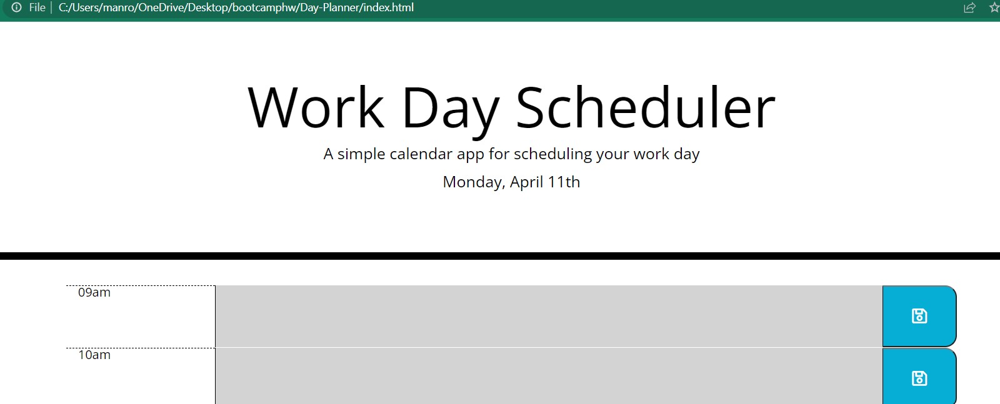

# Day-Planner

A day planner is a tool that many people consider essential to ensure that lives run smoothly. This day planner is very basic, it allows the user to save tasks in specific time slots and additionally the time slots change colour based on if the time slot hour is in the past, future or present. Moments.js is used to assist manipulate and display the date & time. 

<a href="https://manny1998.github.io/Day-Planner/">Day Planner</a>

